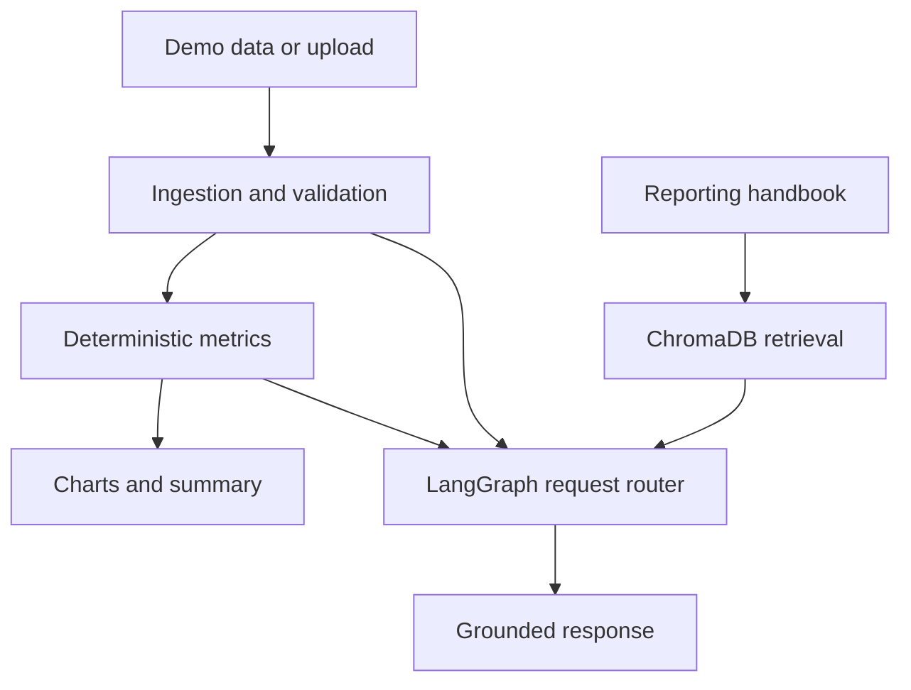

# ReportOps

ReportOps is an agentic reporting and data-quality copilot for recurring spreadsheet workflows. It validates uploaded operational data, calculates KPIs with deterministic Python functions, creates interactive visualizations, and answers questions using analysis tools and cited reporting guidance. The project combines reliable data processing with a small LangGraph workflow and a focused RAG pipeline.

> **Project status:** Day 1 — repository setup and synthetic data generation.

## Why this project

Recurring business reports often begin with spreadsheets that contain missing fields, duplicated records, invalid values, or inconsistent totals. Finding these problems manually is slow, and asking an LLM to perform calculations directly can produce unreliable results.

ReportOps separates those responsibilities: Python handles validation and arithmetic, while the LLM interprets verified results, routes natural-language requests, and explains reporting rules. The demo uses fully synthetic multi-location operations data and does not contain confidential or real company information.

## Planned MVP

The first release will:

- Load included demo data or user-uploaded CSV and Excel files.
- Detect five classes of data-quality issues.
- Calculate four operational KPIs using deterministic functions.
- Display three interactive Plotly charts.
- Generate a structured executive summary from validated facts.
- Route natural-language questions to analysis, visualization, validation, or retrieval tools.
- Retrieve KPI definitions and reporting rules from a small knowledge base with citations.
- Run as a public Streamlit application.

## Demo dataset

The synthetic dataset represents 15 locations across several regions and 12 monthly periods.

| Field | Description |
| --- | --- |
| `location_id` | Stable synthetic location identifier |
| `location_name` | Synthetic location name |
| `region` | Region used for grouped reporting |
| `month` | Reporting period |
| `revenue` | Actual revenue |
| `budget_revenue` | Budgeted revenue |
| `labor_expense` | Actual labor expense |
| `other_expense` | Other operating expense |
| `volume` | Synthetic operational volume |

The generator will create clean current-period, prior-period, and budget data, plus five corrupted files with known expected errors. A fixed random seed will make every run reproducible.

## Validation rules

1. **Required columns:** detect missing fields needed for reporting.
2. **Duplicate records:** detect repeated `location_id` and `month` combinations.
3. **Missing values:** detect blank required identifiers or numeric values.
4. **Impossible values:** detect values such as negative volume or invalid dates.
5. **Reconciliation:** when a total-expense field is supplied, detect rows where its components do not add to the total.

## KPI definitions

| KPI | Calculation |
| --- | --- |
| Revenue variance to budget | `revenue - budget_revenue`, reported as both amount and percentage |
| Month-over-month revenue change | Change in revenue from the prior reporting month |
| Operating margin | `(revenue - labor_expense - other_expense) / revenue` |
| Labor expense percentage | `labor_expense / revenue` |

Division-by-zero and missing-input behavior will be handled explicitly and covered by tests.

## Planned architecture

The application will keep calculations outside the LLM. Uploaded or demo data will be normalized and validated first; only validated facts and structured errors will be passed to later components.



Planned request routes:

| Route | Example request | Primary capability |
| --- | --- | --- |
| Analyze | Why did a location's margin decrease? | Compare calculated metrics |
| Visualize | Compare labor expense by region. | Create a chart |
| Investigate | Why was this row flagged? | Explain a validation result |
| Define | How is operating margin defined? | Retrieve a cited reporting rule |

## Technology

- Python and Pandas for ingestion, validation, and KPI calculations
- Pydantic for structured validation issues and model responses
- Plotly and Streamlit for the interactive application
- LangGraph for lightweight request routing
- Gemini for grounded summaries and conversational responses
- ChromaDB for reporting-handbook retrieval
- Pytest for unit and workflow tests

## Repository structure

```text
reportops/
├── app.py
├── src/reportops/
│   ├── models.py
│   ├── ingestion.py
│   ├── validation.py
│   ├── metrics.py
│   ├── charts.py
│   ├── retrieval.py
│   ├── tools.py
│   ├── graph.py
│   └── reporting.py
├── data/demo/
├── docs/reporting_handbook/
├── notebooks/data_exploration.ipynb
├── scripts/generate_demo_data.py
├── tests/
├── requirements.txt
├── .env.example
└── README.md
```

This is the target structure; modules will be added as each milestone is implemented.

## Local setup

Python 3.11 is recommended.

```bash
git clone <your-repository-url>
cd reportops

python -m venv .venv
source .venv/bin/activate
python -m pip install --upgrade pip
pip install -r requirements.txt
```

When LLM functionality is added, copy `.env.example` to `.env` and add the required API key locally. Never commit `.env` or any secret value.

## Running the project

The Day 1 target command will regenerate all clean and corrupted demo files:

```bash
python scripts/generate_demo_data.py
```

Once the interface is implemented, run it locally with:

```bash
streamlit run app.py
```

Run the test suite with:

```bash
pytest
```

## Development plan

- [ ] Day 1: Repository setup and reproducible synthetic data
- [ ] Day 2: Ingestion, validation models, and validation tests
- [ ] Day 3: KPI calculations, charts, and fallback summary
- [ ] Day 4: Initial Streamlit application and early deployment
- [ ] Day 5: Structured Gemini summary grounded in calculated facts
- [ ] Day 6: LangGraph request routing
- [ ] Day 7: Reporting handbook and evaluated RAG pipeline
- [ ] Day 8: Chat integration
- [ ] Day 9: Validation, metric, routing, retrieval, and grounding evaluation
- [ ] Day 10: Documentation, screenshots, demo video, and portfolio polish

## Day 1 definition of done

- The repository and virtual environment are created.
- Dependencies install successfully from `requirements.txt`.
- The dataset schema is finalized.
- One seeded command creates the clean demo files and five corrupted files.
- Generated files are reproducible across runs.
- The first validation function correctly identifies one known seeded issue.
- The working milestone is committed to GitHub.

## Evaluation plan

The finished project will publish measured results for:

- Validation detection: expected errors, detected errors, misses, and false positives
- KPI correctness: calculated values compared with manually verified values
- Routing accuracy: intended versus selected route for representative prompts
- Retrieval accuracy: whether the correct handbook section appears in the retrieved results
- Grounding: whether each narrative claim is supported by a calculated result or retrieved rule

Results will be added only after the evaluations have been run.

## Scope and limitations

The MVP intentionally excludes autonomous data correction, multiple collaborating agents, forecasting, authentication, databases, a separate API backend, and elaborate cloud infrastructure. These may be considered later only if they make the deployed demo clearer, more reliable, or more useful.

## License

No license has been selected yet.